# Meteor Tutorial: Building a React-Yelp-Clone Clone

**NOTE:** This tutorial is a work-in-progress. This notice will be removed when it's done.

## Motivation

[Someone][wuworkshop] over at [CodeBuddies][cb]' Slack Channel recently linked me to [Fullstack.io][fullstack]'s [React tutorial][react-tutorial]. Initially I was excited, as learning React has been on my to-do list for a while now. But as I started following along, I quickly got frustrated by how much work was involved. After half an hour, I still hadn't written a single line of actual app code, but I had already installed about 20 NPM packages, and written copious amounts of arcane configuration files.

Long story short, after scrolling forward for a bit and realizing I would still be spending at least another 20 minutes on my setup, I got impatient and decided to do this project in [Meteor][meteor] instead. This is the story of what happened next.

[wuworkshop]: https://github.com/wuworkshop
[cb]: http://codebuddies.org
[fullstack]: http://www.fullstack.io
[react-tutorial]: https://www.fullstackreact.com/articles/react-tutorial-cloning-yelp/
[react-yelp-clone]: https://github.com/fullstackreact/react-yelp-clone
[meteor]: https://www.meteor.com/

## Creating the app

First, we'll ask Meteor to create a new project for us. This couldn't be any simpler:

    meteor create meteor-yelp-clone

Now, we simply `cd` into the new directory and run `meteor`, and we already have a working server that we can visit in the browser.

    cd meteor-yelp-clone
    meteor

Compare that to the React version, which spends the first 10 minutes setting up the build environment. Granted, there isn't much to see here either, but at least there's a little button we can click on that increases a counter. Even an `npm start` script is already preconfigured for us.


The score so far: Meteor: 1, React: 0.

## Font Awesome

Again, this is pretty simple. There's already a number of prebuilt packages available, so all we have to do here is run

    meteor add fortawesome:fontawesome

and we're good to go. We don't even need to restart the server, it automatically detects the new package and loads it for us. Awesome.

To test that this is working, we can add a little `<i class="fa fa-star"></i>` to our main.html. And while the React Tutorial is still explaining `postcss` and CSS modules, we're already moving on to the next step. Meteor: 2 - React: 0.


## Setting up Testing

This is something I don't have much experience with but from what I know so far, we'll want to start with the `practicalmeteor:mocha` package.

    meteor add practicalmeteor:mocha

This conveniently also adds sinon and chai for mocking and expectations.

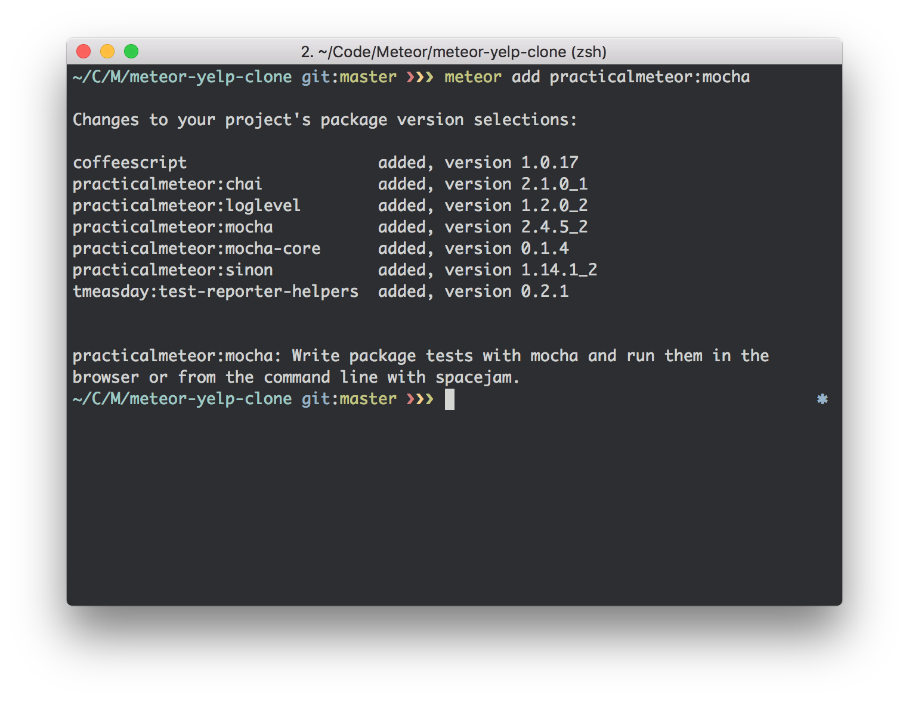

However, we have nothing to test yet, because unlike React, we don't need a dedicated app container. Meteor already does that for us. We can, however, already configure our `package.json` so we can run our tests easily by typing `npm test`. In order to do that, we simply add the following line to the `"scripts"` section:

```json
  "scripts": {
    "start": "meteor run",
    "test": "meteor test --driver-package=practicalmeteor:mocha --port 3030"
  }
```

The `meteor test` command needs us to specify the driver package (there are [several different ones available][meteor-test-driver-packages]). Since the [`practicalmeteor:mocha`][practicalmeteor:mocha] package includes an HTML test runner that will display all of our tests in a browser, it actually starts a full Meteor server. Because our app is already running on port 3000, we'll have to tell it to run on a different port.

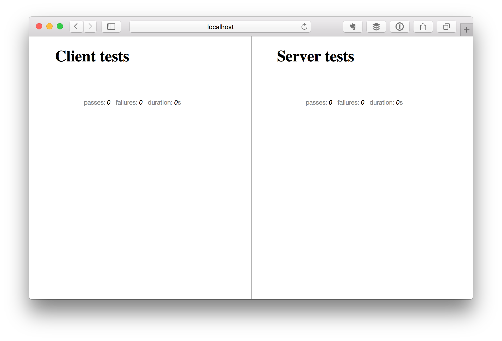

We don't have any tests yet (because there isn't really anything to test), but that will change soon.
And while the React folks are still tweaking their `karma.conf.js`, we're off to the next step. Meteor: 3 - React: still 0.

[meteor-test-driver-packages]: http://guide.meteor.com/testing.html#driver-packages
[practicalmeteor:mocha]: https://atmospherejs.com/practicalmeteor/mocha

## Creating the Directory Structure

Now before we start building our actual app, lets take a moment and create the directory structure we'll be using. For this article, I decided to go with the [recommendation][meteor-dir-structure] in the [official Meteor Guide][meteor-guide]. This means we will be using [ES2015 modules][es2015-modules], and most of our application code will live in various subdirectories of the the `imports` directory.

    mkdir -p imports/{startup,api,ui}
    mkdir -p imports/startup/{client,server}
    mkdir -p imports/ui/{components,layouts,pages}

[es2015-modules]: https://developer.mozilla.org/en/docs/web/javascript/reference/statements/import
[meteor-dir-structure]: http://guide.meteor.com/structure.html#example-app-structure
[meteor-guide]: http://guide.meteor.com

## Setting up Routing

We'll also need a way to route different URLs to different views, therefore we require a router. Again, we'll go with the recommendation from the official guide and use `kadira:flow-router`. We'll also need the `kadira:blaze-layout` package, so let's install both right now:

    meteor add kadira:flow-router kadira:blaze-layout

Again, going with the recommendation, we'll store our routes in `imports/startup/client/routes.js`. We'll start with just one route for the main URL, which we'll call home.

```javascript
import { FlowRouter } from 'meteor/kadira:flow-router'
import { BlazeLayout } from 'meteor/kadira:blaze-layout';

FlowRouter.route('/', {
  name: 'home',
  action() {
    BlazeLayout.render("mainLayout", { content: "home" });
  }
});
```

This creates a route named "home", which renders a template named "home" within a layout named "mainLayout". Now we just need to create those two files. Let's start with the layout, which we'll store in `imports/ui/layouts/main.html`:

```handlebars
<template name="mainLayout">
  <header>
    {{>Template.dynamic template=header}}
  </header>

  <main>
    {{>Template.dynamic template=content}}
  </main>

  <footer>
    {{>Template.dynamic template=footer}}
  </footer>
</template>
```

And now here's our "home" template, `imports/ui/pages/home.html` (don't worry about the missing templates for header and footer for now, we'll be adding those later):

```handlebars
<template name="home">
  Hello from the import side
</template>
```

I know, we've going for a dangerously long time now without seeing anything happen in the browser, so let's fix that right now. For this purpose, we'll create a file named `imports/startup/client/index.js` with the following contents:

```javascript
// routes
import './routes.js';

// templates
import '../../ui/layouts/main.html';
import '../../ui/pages/home.html';
```

This file basically pulls together all the stuff we need on the client, so we can easily import it in our `client/main.js` file. Now we simply delete all the pre-generated content in that file and simply replace it with this line:

```javascript
import '/imports/startup/client';
```

We'll also have to delete the default `client/main.html`, because otherwise, Meteor will still end up rendering that.

    rm client/main.html

If you did everything correctly, your browser should now show this:


Let's see how the React folks are doing, shall we? There's probably still configuring the router. Let's skip ahead for a bit and do something more fun. Looks like they're going to be working on the Google Maps integration next.

## Building a Google Maps Component

So, over at Fullstack React, [they are using a pre-built React component][react-google-maps], so I'm sure it won't be considered cheating if we do the same. We'll use the [`dburles:google-maps`][meteor-google-maps] package, which can be installed by running

    meteor add dburles:google-maps

Now, let's create a [Blaze component][meteor-blaze-components] to use that map. First, we'll need a new directory to hold the files:

	mkdir imports/ui/components/map
	
The component has two parts: a (HTML) template and some JavaScript. First, here's the template, `imports/ui/components/Map/Map.html`:

```handlebars
<template name="Map">
  <div class="map-container">
    {{> googleMap name="map" options=mapOptions}}
  </div>
</template>
```

> **NOTE** 
>
> As a convention, I'm going to be naming all of my components starting with an uppercase letter, while I'm going to be naming my pages starting with a lowercase letter.

Now, here's the JavaScript part, `imports/ui/components/Map/Map.js`:

```javascript
import { Meteor } from 'meteor/meteor';
import { Template } from 'meteor/templating';
	
import './Map.html';
	
Template.Map.onRendered(function() {
  GoogleMaps.load({
    key: Meteor.settings.public.googleApiKey
  });
})
	
Template.Map.helpers({
  mapOptions() {
    const { center, zoom } = Template.currentData();
	
    if (GoogleMaps.loaded()) {
      return {
        center: new google.maps.LatLng(center.lat, center.lng),
        zoom: zoom
      };
    }
  }
})
```

Here, we are using [Meteor.settings][meteor-settings] to inject our Google API key into the component. This is Meteor's way of storing configuration data. In order for this to work, we'll need to create a settings file, and then point the server to that file when we start it. Let's do that now.

First, here's the settings file, `settings/development.json`:

```json
{
  "public": {
    "googleApiKey": "YOUR_GOOGLE_API_KEY_HERE"
  }
}
```

Now, in order to have the server load this file on startup, we need to run it with the `--settings=settings/development.json` option. Since we don't want to have to remember to do that every time, we'll just put this into the `scripts` section of our `package.json`.

```json
"scripts": {
  "start:dev": "meteor run --settings=settings/development.json",
  "test": "meteor test --settings=settings/test.json --driver-package=practicalmeteor:mocha --port 3030"
}
```

As you can see, we also added this option to our `npm test` script, so that our tests have access to the settings as well. For now, the `settings/test.json` file is simply a copy of `settings/development.json`. 

	cp settings/development.json settings/test.json
    
Now we'll have to stop our currently running server and restart it again by typing

    npm run start:dev
    
And we're off to the races again. Now, all we have left to do is use our new component. First, we will add it to our `imports/startup/client/index.js` file so it is available in our app:

```javascript
// components
import '../../ui/components/Map/Map.js';
```

Then, we'll add it to our "home" template by modifiying it as follows:

```handlebars
<template name="home">
  Hello from the import side
	
  {{> Map center=mapCenter zoom=defaultZoom}}
</template>
```

Finally, we need to add some helpers for this template, to pass in the map center and the default zoom level. We need to create a new file, `imports/ui/pages/home.js` with the following content:

```javascript
import { Template } from 'meteor/templating';
	
import './home.html';
	
Template.home.helpers({
  mapCenter() {
    return { lat: -37.8136, lng: 144.9631 }
  },
	
  defaultZoom() {
    return 8
  }
})
```

Now, back in `imports/startup/client/index.js`, we simply change the line

```javascript
import '../../ui/pages/home.html';
```

to end in `.js` instead of `.html`:

```javascript
import '../../ui/pages/home.js';
```

Here's what you should be seeing now in your browser:

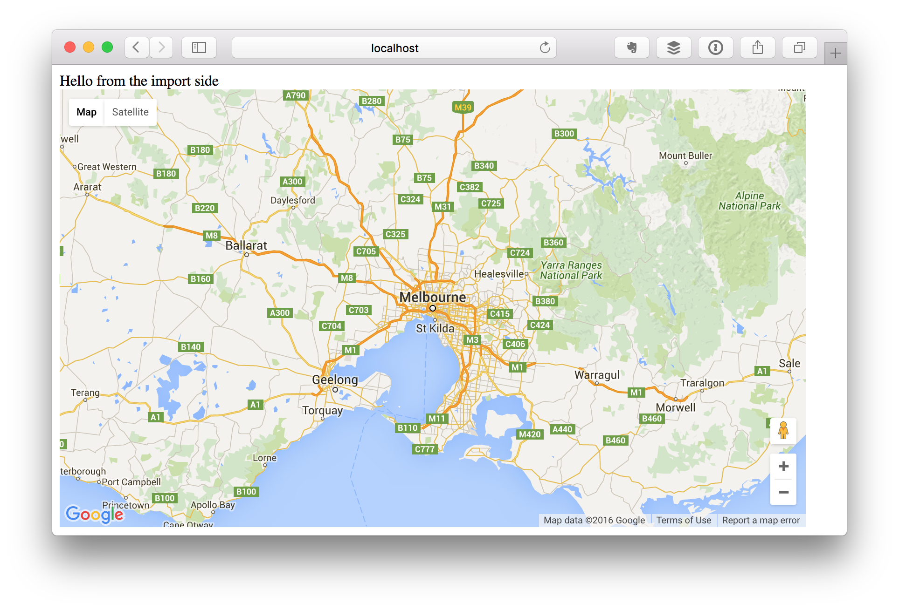

At this point, you may have noticed that the `meteor test` command is trying to warn us about still having the `autopublish` package enabled. Since we're only working on the frontend, we don't really need it anyways, so let's just remove it along with the `insecure` package (which makes all collections publicly writable by default).

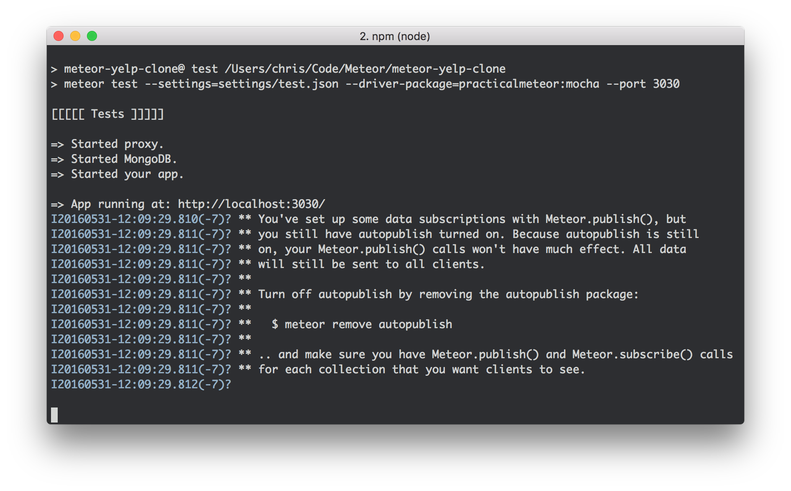

Simply run 

	meteor remove insecure autopublish
	
And the warning will disappear.

[react-google-maps]:https://www.fullstackreact.com/articles/react-tutorial-cloning-yelp/#routing-to-maps
[meteor-google-maps]: https://github.com/dburles/meteor-google-maps
[meteor-blaze-components]: http://guide.meteor.com/blaze.html#reusable-components
[meteor-settings]: http://docs.meteor.com/api/core.html#Meteor-settings

## Writing a Test for the Map Component

So, we've finally achieved some significant functionality. Time to write a test! Again, we'll take a [page from the Meteor Guide][meteor-unit-test] and implement a simple unit test for our component. Before we do this, we'll need to add the [`imports/ui/test-helpers.js`][meteor-test-helper] mentioned in that guide. I won't reproduce the file here, since you can find it at the link above.

Now we can go ahead and write the test in `imports/ui/components/Map/client/Map.tests.js` as follows:

```javascript
/* eslint-env mocha */
/* eslint-disable func-names, prefer-arrow-callback */
	
import { chai } from 'meteor/practicalmeteor:chai';
import { Template } from 'meteor/templating';
import { $ } from 'meteor/jquery';
	
import { withRenderedTemplate } from '../../../test-helpers.js';
import '../Map.js';
	
describe('Map component', function () {
  it('renders correctly with simple data', function () {
    const center = { lat: -37.8136, lng: 144.9631 };
    const zoom = 8;
    const data = { center, zoom };
	
    withRenderedTemplate('Map', data, el => {
      chai.assert.equal($(el).find('.map-canvas').length, 1);
    });
  });
});
```

If you did everything right, the test runner should now show a passing test:


[meteor-unit-test]: http://guide.meteor.com/testing.html#simple-unit-test
[meteor-test-helper]: https://github.com/meteor/todos/blob/master/imports/ui/test-helpers.js

## Adding Place Search to our Map Component

Next, we want our Map component to be able to search for and display places matching a certain query. Since we want to keep all the Google Maps handling code local to our component (to ensure proper encapsulation), we need to implement this functionality *inside* the component.

We'll start by changing the `onRendered` callback in our Map component to load the places API alongside with Google Maps. We'll also store the `map` object that the API returns in a [`ReactiveVar`][meteor-reactive-var] that's scoped to the template:

```javascript
import { ReactiveVar } from 'meteor/reactive-var';
    
Template.Map.onCreated(function () {
  this.map = new ReactiveVar();
})

Template.Map.onRendered(function() {
  GoogleMaps.load({
    key: Meteor.settings.public.googleApiKey,
    libraries: 'places'
  });
	
  GoogleMaps.ready('map', (map) => {
    this.map.set(map);
  });
})
```

This ensures that whenever the `GoogleMaps.ready()` callback is called, the `map` instance is attached to the template, and anything that depends on it will automatically be re-computed thanks to [Meteor's reactivity tracker][meteor-tracker].

Now, we'll create a helper function to let us run an arbitrary query against a given Google Maps object (this will be a private function, so just drop it at the bottom of `Map.js`):
	
```javascript
function searchNearby(map, query) {
  const service = new google.maps.places.PlacesService(map.instance);
	
  service.nearbySearch(query, (results, status, pagination) => {
    if (status == google.maps.places.PlacesServiceStatus.OK) {
      console.log(results)
    } else {
      console.log(status)
    }
  })
}
```
	
As you can see, this function creates a new `PlaceService` instance and runs the query against that. When the results are ready, a callback is called that prints them out to the terminal. We can immediately test this by adding the following code to the bottom of our `onCreated` callback:

```javascript
this.autorun(() => {
  const map = this.map.get();
  const query = { 
	center: map.options.center,
	radius: 500,
	type: 'cafe'
  };
  if (map) {
    searchNearby(map, query);
  }
})
```
	
Using `this.autorun()` ensures that Meteor will automatically detect any reactive dependencies used in the callback (that's why we made `this.map` a `ReactiveVar`) and re-run the callback when those dependencies change.

Once you saves this change, you should be able to see your Meteor app reload automatically, and if you open your browser's JavaScript console, you'll see the results of the place search logged there:


[meteor-reactive-var]: http://docs.meteor.com/api/reactive-var.html
[meteor-tracker]: http://docs.meteor.com/api/tracker.html

## Adding Markers to the Map

Now that we have a basic place search functionality going, it would be cool if our app was able to display the results on a map, instead of printing them to the console (where no user would ever bother to look). Let's do that next.

First, we'll create a couple more helper functions to work with markers (we'll add them to the end of our `imports/ui/components/Map/Map.js` file):

```javascript
// Creates a marker from a place, but doesn't add it to a map
function createMarker(place) {
  return new google.maps.Marker({
    position: place.geometry.location,
    title: place.name
  });
}
	
// Adds a marker to the given map
function addMarker(map, marker) {
  if (!(marker instanceof google.maps.Marker)) {
    marker = createMarker(marker);
  }
  marker.setMap(map.instance);
	
  return marker;
}
	
// Removes a marker from a map
function removeMarker(marker) {
  marker.setMap(null);
}
```

It's worthwile to note that the `addMarker` function is flexible and will accept a place object instead of a marker as its second argument for convenience. 

Now, we want our `searchNearby` function to create place markers whenever there are results available. However, in the interest of not letting this function become too complex, we'll handle this a bit differently. First, we'll add another `ReactiveVar` to our component. This one will store the place results. 

```javascript
Template.Map.onCreated(function () {
  this.map = new ReactiveVar();
  this.places = new ReactiveVar([]);
  
  this.autorun(() => { /* ... */ });
});
```
	
Next, we'll update the `searchNearby` function to store the results in this variable. We'll simply pass in the `ReactiveVar` as a third parameter, and have the function update its contents like this:

```javascript
function searchNearby(map, query, places) {
  const service = new google.maps.places.PlacesService(map.instance);
	
  service.nearbySearch(query, (results, status, pagination) => {
    if (status == google.maps.places.PlacesServiceStatus.OK) {
      console.log(results)
      places.set(results)
    } else {
      console.log(status)
    }
  });
}
```

Now, we change our `this.autorun()` callback to pass this parameter along:

```javascript
 if (map) {
   searchNearby(map, query, this.places);
 }
```

> **NOTE**
>
> It it important to realize that even though `this.places` is a `ReactiveVar`, simply passing it along as a reference to `searchNearby` does NOT cause the `autorun` callback to be re-evaluated. A dependency is only created if we call `.get()` on that variable. Otherwise, we would be creating an endless loop here.

Next, we'll want to create place markers each there are new place results. For this, we'll add another `this.autorun()` block to our `onCreated` callback:

```javascript	
  // automatically add markers to map when places have changed
  let markers = [];
  this.autorun(() => {
    const map = this.map.get();
    const places = this.places.get();
    // remove old markers from map before adding new ones
    markers.forEach((marker) => removeMarker(marker));
    markers = places.map((place) => addMarker(map, place));
  });
```
	  
This block depends on both the `this.map` and the `this.places` reactive vars (it is helpful to declare them at the top of the block so the dependencies are immediately obvious). Since we'll have to remove the old markers before adding new ones (otherwise, the old ones will stay around forever, crowding up the map), we need to store them somewhere. We use a local variable called `markers` for this purpose, whose contents we overwrite each time the block is re-evaluated. Note that this variable has to be declared *outside* the callback. 

If you did everything right, when your app has reloaded, you should now see the map being populated with markers:

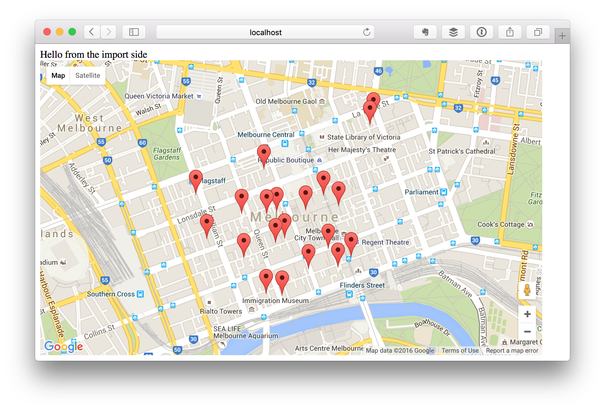

> **NOTE**
>
> You'll noticed I've changed the default zoom setting here, so we can actually tell the different markers apart. Since we did a radius search, Google will prioritize places that are closes to the center of the map to those that are further away. The zoom level in this picture is set to `15`, which can be changed in `imports/ui/pages/home.js`.
	
Finally, in order for our component to be even more useful, we want it to be able to communicate with the outside world. For instance, instead of using a static query, we'd like the ability to pass in a query through the [template parameters][meteor-template-params], and when the search results are available, have a callback called with the new results.

For the first part, all we have to do is change the first `autorun()` block as follows:

```javascript
  // automatically search places if query has changed
  this.autorun(() => {
    const map = this.map.get();
    const { query } = Template.currentData();

    if (map && query) {
      query.bounds = map.instance.getBounds();
      searchNearby(map, query, this.places);
    }
  });
```

This code simply extracts the `query` object from the template's data using [`Template.currentData()`][meteor-template-currentData], and if both the `map` and the `query` are defined, runs our `searchNearby` function to retrieve the results. Note that I've also changed the search to apply to only the visible map area, instead of doing a radius search around the map's center. This changes the sort order a bit, but ensures that all places will always be in the visible part of the map.

Finally, in order to notify outside observer about our changes, we'll add *another* `this.autorun()` block inside our `onCreated` callback. This one reads as follows:

```javascript
  // notify observers when places have changed
  const { onPlacesChanged } = Template.currentData();
  this.autorun(() => {
    const places = this.places.get();
    typeof onPlacesChanged === 'function' && onPlacesChanged(places);
  });
```

In other words, whenever the the `this.places` reactive variable has been updated, *and* the `onPlacesChanged` template parameter is a function, we call that function with the new list of places.

Finally, we need to update our `home` template to pass in a query from the outside, so we can still see the map populate. Change the line in `imports/ui/pages/home.html` that loads our map component to read as follows:

```handlebars
  {{> Map center=mapCenter zoom=defaultZoom query=query}}
```

Then add the following helper to `imports/ui/pages/home.js`:

```javascript
  query() {
    return { type: 'cafe' }
  }
```
Now the app should load and behave just like before, although it may show slightly different results (because we changed from a radius search to a map bounds search).

[meteor-template-params]: http://guide.meteor.com/blaze.html#inclusion
[meteor-template-currentData]: http://docs.meteor.com/api/templates.html#Template-currentData

## Excursion: Creating a Place Search Component

At this point, I had wanted to write a test case for the place search callback behavior, but I had difficulties getting that to work. So, while the FullStack guys are moving ahead with building header and sidbar components, I decided to take a bit of a detour and make the map more interactive first, by adding a component to allow me to perform arbitrary place searches on the map.

Here's the idea: I want a text input field to search for keywords, and a dropdown with all the place types to narrow results by category. And in order to practice building reusable components (and exchanging data between them), I want this to be a component as well.

Let's start with the template, `imports/ui/components/PlaceSearch/PlaceSearch.html`:

```handlebars
<template name="PlaceSearch">
  <input name="keyword" placeholder="Keyword">
  <select name="type">
    <option value="">-- Select Type --</option>
    {{#each placeTypes}}
      <option value={{type}}>{{display}}</option>
    {{/each}}
  </select>
</template>
```

Here we can see the text input and the dropdown. The latter obviously will require a `placeTypes` helper to provide a list of place types. The [full list is available here][google-place-types]. I simply copied and pasted it from Google's Developer documentation and converted it to JSON by hand. You can see the [full JSON file here][PlaceTypes.json]. Note that all of these are lower case and contain underscores. Some of them are followed by `(*)`, which means that according to the Google docs, they are deprecated and will be removed on February 16, 2017. I left these in for now, but we'll have to treat them specially, as we'll see in just a minute. 

Let's start with our template helpers (in `imports/ui/components/PlaceSearch/PlaceSearch.js`):

```javascript
import { Template } from 'meteor/templating';
import { humanize, titleize } from 'underscore.string';
import PlaceTypes from './PlaceTypes.json';

import './PlaceSearch.html';

Template.PlaceSearch.helpers({
  placeTypes() {
    return PlaceTypes.map((type) => {
      return { type, display: titleize( humanize(type) ) };
    });
  }
});
```

Our `placeTypes` helper simply iterates over the entire list of place types and turns them into objects with a `type` and a `display` property. The latter is automatically computed from the former, using two functions, `humanize` and `titleize` from a package called [`underscore.string`][underscore.string]. These get rid of the underscores and capitalize every word, respectively.

Sure, I could have simply used a regular expression here, but this gives us a chance to try out Meteor's new NPM integration. Also, this code is arguably much easier to read. Since version 1.3, [Meteor has full support for NPM packages][meteor-npm-support]. All we need to do is install the package using the following command:

    meteor npm install --save underscore.string

> **NOTE**
> 
> If you have Node.js installed separetely from Meteor, you can also simply run `npm install --save underscore.string`.

Now, similar to our map component, we would like this component to run a callback whenever its internal state (in this case, the values of the form fields) changes. So lets hook that up with an event handler now:

```javascript
Template.PlaceSearch.events({
  'change input, change select'(event, instance) {
    const { onQueryChanged } = Template.currentData();
    const query = {
      keyword: instance.$('input[name=keyword]').val(),
      type:    instance.$('select[name=type]').val()
    };

    if (typeof onQueryChanged === 'function') {
      onQueryChanged(query);
    }
  }
});
```

This is pretty similar to what we've done in the map component, the only new thing is using jQuery to extract the values from the form fields. Note that we're using `instance.$` to scope the lookup to the current template instance, [as recommended by the Meteor guide][meteor-scope-jquery].

[google-place-types]: https://developers.google.com/places/supported_types#table1
[PlaceTypes.json]: imports/ui/components/PlaceSearch/PlaceTypes.json
[underscore.string]: http://epeli.github.io/underscore.string/
[meteor-npm-support]: http://guide.meteor.com/using-npm-packages.html
[meteor-scope-jquery]: http://guide.meteor.com/blaze.html#scope-dom-lookups-to-instance

## Writing Tests for the Place Search Component

Now, before we actually wire up this component into the rest of the app, let's write some tests for it. I'm going to omit the import and setup code here for brevity and focus on the actual test cases. You can find the full test in the [repository][PlaceSearch.tests.js]. 

First, let's write some tests to ensure that both our form fields are present:

```javascript
  it('has a "keyword" input', function() {
    withRenderedTemplate('PlaceSearch', {}, el => {
      chai.assert.equal($(el).find('input[name=keyword]').length, 1);
    });
  });

  it('has a "type" dropdown', function() {
    withRenderedTemplate('PlaceSearch', {}, el => {
      chai.assert.equal($(el).find('select[name=type]').length, 1);
    });
  });
```

Next, we're going to write some tests to ensure that the callback is called when we expect it (i.e. when one of the inputs has changed):

```javascript
  it('calls "onQueryChanged" when keyword has changed', function(done) {
    const data = {
      onQueryChanged(query) {
        chai.assert.equal(query.keyword, 'test');
        done();
      }
    };

    withRenderedTemplate('PlaceSearch', data, el => {
      $(el).find('input[name=keyword]').val('test').change();
    });
  });

  it('calls "onQueryChanged" when type has changed', function(done) {
    const data = {
      onQueryChanged(query) {
        chai.assert.equal(query.type, 'airport');
        done();
      }
    };

    withRenderedTemplate('PlaceSearch', data, el => {
      $(el).find('select[name=type]').val('airport').change();
    });
  });
```

Note we're making use of [Mocha's support for asynchronous code][mocha-async] here. Let's quickly check our test runner to make sure everything is in order:

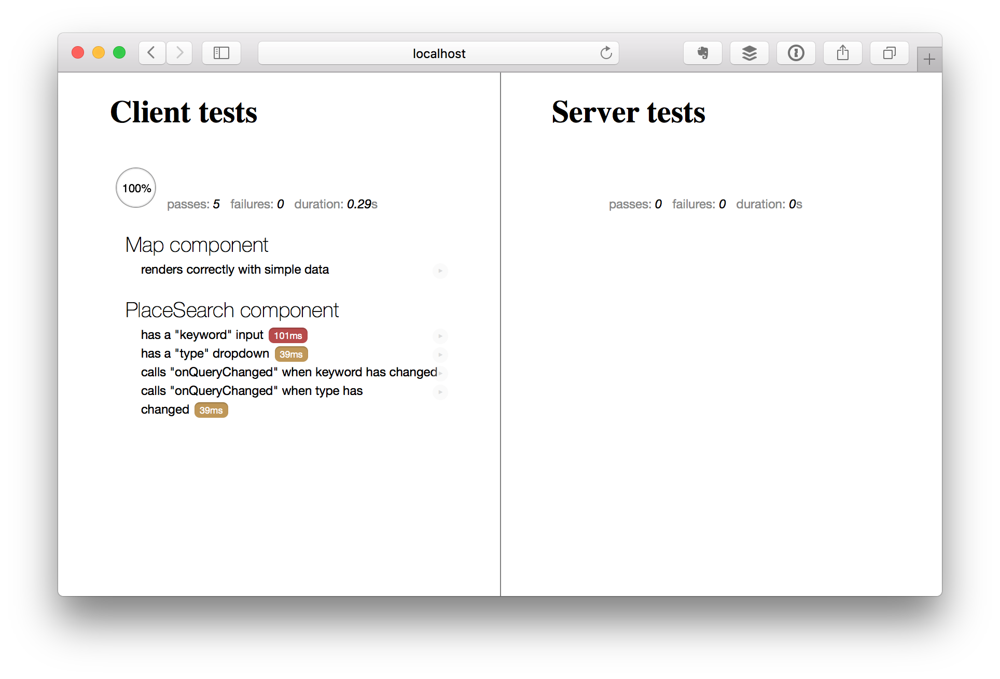

Looks like we're good to go. Now before we move on to the next step, let's just clean up the code a little bit. As you may have noticed, the two pairs of tests we wrote look awefully similar. 

From the first pair, we can extract the following helper (which we'll store in `imports/ui/test-helpers.js`:

```javascript
export const ensureElement = function ensureElement(template, data, selector, count=1) {
  withRenderedTemplate(template, data, el => {
    chai.assert.equal($(el).find(selector).length, count);
  });
};
```

With this, we can write the first pair of tests as follows:

```javascript
  it('has a "keyword" input', function() {
    ensureElement('PlaceSearch', {}, 'input[name=keyword]');
  });

  it('has a "type" dropdown', function() {
    ensureElement('PlaceSearch', {}, 'select[name=type]');
  });
```

The next pair is a bit more difficult. Here, we need to pass in a callback that will run the final assertion to make the test pass (again, using Mocha's support for asynchronous code). The helper simply merges the callback into the data, renders the template, and triggers the event that will kick off the callback:

```javascript
export const ensureCallbackOnElementChange = function ensureCallbackOnElementChange(template, data, selector, callback, value) {
  data = Object.assign(data, callback);

  withRenderedTemplate(template, data, el => {
    $(el).find(selector).val(value).trigger('change');
  });
};
```

With this, we can rewrite the second pair of tests like this:

```javascript
  it('calls "onQueryChanged" when keyword has changed', function(done) {
    ensureCallbackOnElementChange('PlaceSearch', {}, 'input[name=keyword]', { onQueryChanged(query) {
      chai.assert.equal(query.keyword, 'test');
      done();
    }}, 'test');
  });

  it('calls "onQueryChanged" when type has changed', function(done) {
    ensureCallbackOnElementChange('PlaceSearch', {}, 'select[name=type]', { onQueryChanged(query) {
      chai.assert.equal(query.type, 'airport');
      done();
    }}, 'airport');
  });
```

*Much* better.

[PlaceSearch.tests.js]: imports/ui/components/PlaceSearch/client/PlaceSearch.tests.js
[mocha-async]: https://mochajs.org/#asynchronous-code

## Using the Place Search Component in our App

Okay, time to actually use our brand new component! First, we'll add it to our `imports/startup/client/index.js` to ensure it is loaded and available to our app:

```javascript
// components
import '../../ui/components/Map/Map.js';
import '../../ui/components/PlaceSearch/PlaceSearch.js';
```

Then, we'll change our `imports/ui/pages/home.html` template to include the new component:

```handlebars
<template name="home">
  Search for something:

  {{> PlaceSearch onQueryChanged=queryChanged }}
  {{> Map center=mapCenter zoom=defaultZoom query=query}}
</template>
```

Let's think this through for a second: obviously, we'll need a callback here, so we can receive updates when the query parameters have changed. But when that is the case, we need the `query` helpers value to update automatically, so that the map component can update itself. Sounds like another job for our trusty friend, `ReactiveVar`:

```javascript
import { ReactiveVar } from 'meteor/reactive-var';

Template.home.onCreated(function() {
  this.query = new ReactiveVar({});
});
```

Now, we just update our `query` helper, and add a `queryChanged` helper as follows:

```javascript
 query() {
   return Template.instance().query.get();
 },
 
 queryChanged() {
   const instance = Template.instance();
   return (query) => { instance.query.set(query); }
 }
```

Instead of a static value, `query` now simply returns the contents of the `this.query` reactive variable, so its value will automatically change when the query changes. The `queryChanged` helper, on the other hand, returns a function that will *update* said reactive variable. 

Wait for the app to reload again, and we should see our new component rendered above the map:


Now, make a change in the place search component, and you should see the markers update:

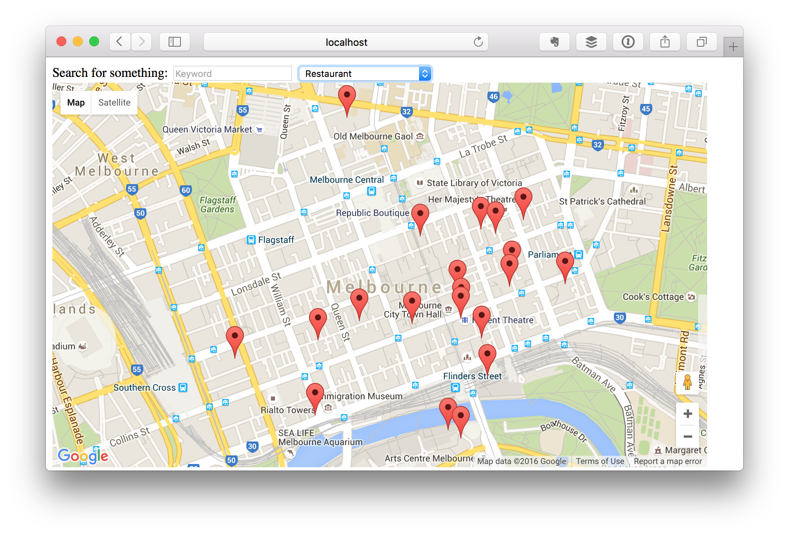

Violà – that concludes our little excursion.

## Adding a Header component

Back to our regularly scheduled programming – we're going to build a nice header component, which will hold the application title and the PlaceSearch component we've just built.

Let's start with the template, `imports/ui/components/Header/Header.html`:

```handlebars
<template name="Header">
  <div class="pure-menu pure-menu-horizontal">
    {{#if title}}
      <a class="pure-menu-heading app-title" href="/">{{title}}</a>
    {{/if}}

    <div class="pure-menu-heading align-right">
      {{> PlaceSearch onQueryChanged=queryChanged }}
    </div>
  </div>
</template>
```

Next, we have the JavaScript code, `imports/ui/components/Header/Header.js`:

```javascript
import { Template } from 'meteor/templating';

import './Header.html';

Template.Header.helpers({
  title() {
    return Template.currentData().title ||
           Meteor.settings.public.appTitle;
  }
});
```

Everything here is pretty straighforward, the only notable thing is the `title()` helper, which does something interesting: it accesses the template's [data context][meteor-data-context] to see if a property called `title` has been passed to the template. If so, it will return that. Otherwise, it will look in the application's settings (passed in via the `--settings` command line option) for a public property named `appTitle` and return that.

Finally, here are the tests for this component (in `imports/ui/components/Header/client/Header.tests.js`):

```javascript
/* eslint-env mocha */
/* eslint-disable func-names, prefer-arrow-callback */

import { chai } from 'meteor/practicalmeteor:chai';
import { Template } from 'meteor/templating';
import { $ } from 'meteor/jquery';

import { ensureElement } from '../../../test-helpers.js';
import '../Header.js';

describe('Header component', function() {
  const data = { title: 'Welp' };

  it('has a title', function() {
    ensureElement('Header', data, '.app-title:contains(Welp)');
  });

  it('renders a horizontal menu', function() {
    ensureElement('Header', data, '.pure-menu.pure-menu-horizontal');
  });
});
```

Nothing new here either, we're simply checking that the component renders a title and a horizontal menu component (which contains the PlaceSearch component).

If everything went well, your app should look something like this:

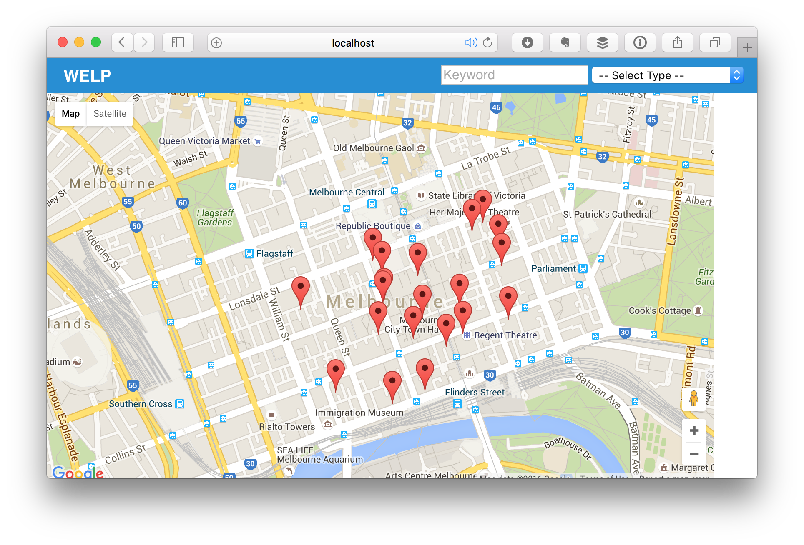

Also, you should have two more passing tests:

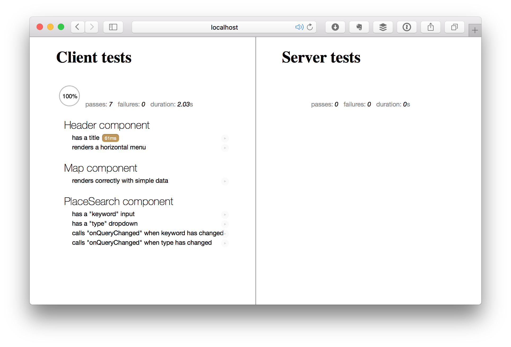

[meteor-data-context]: http://guide.meteor.com/blaze.html#data-contexts

Take a little break for a job well done, and then we'll continue.

## Creating a Menu Component

Next, we'll add a sidebar menu to our app. We'll eventually use it to show a list of places that match the current search, but for now, it will simply display static content.

Here's the template:

```handlebars
<template name="Menu">
  <div class="pure-menu">
    {{#if title}}
      <a class="pure-menu-heading" href="#">{{title}}</a>
    {{/if}}

    <ul class="pure-menu-list">
      {{#each item in menuItems}}
        <li class="pure-menu-item {{isActive item}}">
          <a href="{{item.link}}" class="pure-menu-link">{{item.title}}</a>
        </li>
      {{/each}}
    </ul>
  </div>
</template>
```

And here's the code:


```javascript
import { Template } from 'meteor/templating';

import './Menu.html';

Template.Menu.helpers({
  menuItems() {
    return Template.currentData().menuItems || [
      { title: 'Home',     link: '#' },
      { title: 'About',    link: '#' },
      { title: 'Services', link: '#' , active: true },
      { title: 'Contact',  link: '#' }
    ];
  },
  isActive(item) {
    return item.active ? 'menu-item-divided pure-menu-selected' : '';
  }
});
```

Of course, we're going to write some tests for this as well:

```javascript
/* eslint-env mocha */
/* eslint-disable func-names, prefer-arrow-callback */

import { chai } from 'meteor/practicalmeteor:chai';
import { Template } from 'meteor/templating';
import { $ } from 'meteor/jquery';

import { ensureElement } from '../../../test-helpers.js';
import '../Menu.js';

describe('Menu component', function() {
  const title = 'Welp';
  const menuItems = [
    { title: 'Home',     link: '#' },
    { title: 'About',    link: '#' },
    { title: 'Services', link: '#' , active: true },
    { title: 'Contact',  link: '#' }
  ];

  it('renders a menu', function() {
    const data = { title, menuItems };
    ensureElement('Menu', data, '.pure-menu');
  });

  it('has a title', function() {
    const data = { title, menuItems };
    ensureElement('Menu', data, '.pure-menu-heading:contains(Welp)');
  });

  it('has a list of menu items', function() {
    const data = { title, menuItems };
    ensureElement('Menu', data, '.pure-menu-list');
    menuItems.forEach(item => {
      ensureElement('Menu', data, `.pure-menu-link:contains(${item.title})`);
    });
  });
});
```

Let's make sure the tests are passing:


Now, for a visual test, we'll add the new component to show in our app as well. First, we'll need to add the component to our list of imports in `imports/ui/startup/client/index.js`:

```javascript
// components
import '../../ui/components/Header/Header.js';
import '../../ui/components/Map/Map.js';
import '../../ui/components/Menu/Menu.js';
import '../../ui/components/PlaceSearch/PlaceSearch.js';
```

And then, we'll update our `imports/ui/pages/home.html` template to show the Map and Menu components side-by-side (using Pure.css's [awesome grid classes][purecss-grids]):

```handlebars
<template name="home">
  <div class="pure-g">
    <div class="pure-u-1-3">
      {{> Menu}}
    </div>
    <div class="pure-u-2-3">
      {{> Map center=mapCenter zoom=defaultZoom query=query}}
    </div>
  </div>
</template>
```

Finally, let's update our CSS so that both the menu and the map will take up all the remaining available vertical space:

```css
.app-menu {
  height: calc(100vh - 42px);
  overflow-x: hidden;
  overflow-y: scroll;
}

.map-container {
  height: calc(100vh - 42px);
  max-width: 100%;
}
```

In your browser, this should look something like this:

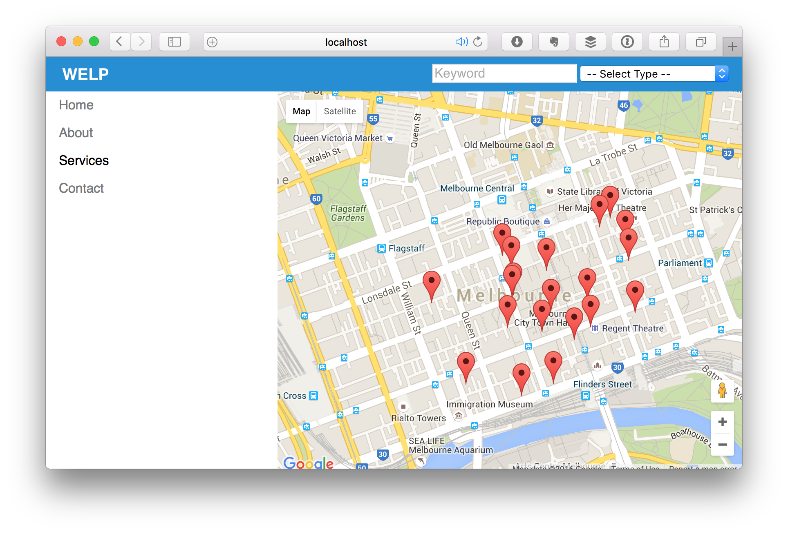

[purecss-grids]: http://purecss.io/grids/
[css-calc]: http://caniuse.com/#search=calc

Make yourself another coffee, we'll be right back to wire everything up.

## Wiring Up Menu and Place Search with Routes

Okay, the next step is going to require us to take a step back and look at the app as a whole rather than the sum of its pieces. Our goal is to have the menu on the left display a list of place names (corresponding to the markers shown on the map), that is updated whenever we perform a new search (such as selecting a different category from the place search form). On top of that, we'll want to be able to click on a result in the menu and show more details for a place – such as its address and perhaps some photos.

Rather than having the `PlaceSearch` component talk directly to the map, we'll use routes to achieve this objective. This gives us the advantage of being able to navigate through our search history using the browser's back and forward buttons, and sharing URLs with friends.

Let's see how this might look like. Currently, we have two pieces of search information: category and keyword. A keyword search can be performed whether we have a category selected or not. Here's how our routes might look like:

| Route                           | Description
| --------------------------------|-------------------------------------
| `/?keyword=test`                | Keyword search w/o category
| `/category/:name/`              | Browse category w/o keword
| `/category/:name/?keyword=test` | Category and keyword search combined

So, first we'll need to create a new route, `category.show` as follows:

```javascript
FlowRouter.route('/category/:category', {
  name: 'category.show',
  action() {
    BlazeLayout.render("mainLayout", { content: "home", header: "Header" });
  }
});
```

You'll notice the route looks exactly the same as our existing one, save for the name and path. This is because parameters in the path have to be defined explicitly. Also, note that query parameters *don't* have to be defined explicitly. 

Next, we'll update the `imports/ui/pages/home.html` template to pass a `menuItems` parameter to our `Menu` component. We'll also pass an `onPlacesChanged` callback to our `Map` component. 

```handlebars
<template name="home">
  <div class="pure-g">
    <div class="pure-u-1-3">
      {{> Menu menuItems=menuItems}}
    </div>
    <div class="pure-u-2-3">
      {{> Map center=mapCenter zoom=defaultZoom query=query onPlacesChanged=placesChanged}}
    </div>
  </div>
</template>
```

Next, we'll create those two new helpers we just used in the template (in `imports/ui/pages/home.js`. But first, we'll need a new `ReactiveVar` to store the current places. We can also get rid of the old `query` variable, because we're no longer going to use it. Don't forget to import `FlowRouter` so we can use it:

```javascript
import { FlowRouter } from 'meteor/kadira:flow-router';

Template.home.onCreated(function() {
  this.places = new ReactiveVar([]);
});
```

Now, we can change the `query` helper to take its parameters from the current route, and add the other two helpers we need as follows:

```javascript
Template.home.helpers({
  // ... removed for brevity ...

  query() {
    return {
      type:    FlowRouter.getParam('category'),
      keyword: FlowRouter.getParam('keyword')
    }
  },
  
  menuItems() {
    const places = Template.instance().places.get();
    return places.map((place) => ({ title: place.name }));
  },

  placesChanged() {
    const places = Template.instance().places;
    return (results) => { places.set(results); }
  }
});
```

The `placesChanged()` helper returns a *function* that takes some results and stores it in an instance variable called `places`. The `menuItems()` helper takes those results and transforms them into a format that the `Menu` component can understand.

Finally, we'll have to update the `Header` component so that when the query changes, it will update the current route appropriately:

```javascript
import { Template } from 'meteor/templating';
import { FlowRouter } from 'meteor/kadira:flow-router';

import './Header.html';

Template.Header.onCreated(function() {
  this.setQuery = (query) =>
    FlowRouter.go(query.type ? 'category.show' : 'home',
      { category: query.type },
      { keyword: query.keyword });
});

Template.Header.helpers({
  // ... title() helper omitted ...

  queryChanged() {
    const instance = Template.instance();
    return (query) => { instance.setQuery(query); }
  }
});
```

As you can see, the `queryChanged()` helper returns a function that will be called with the current query, and calls another function that uses `FlowRouter.go()` to send the browser to the appropriate route (`category.show` if there is a category, and `home` otherwise), passing along the `category` parameter in the path parameters, and the `keyword` parameter in the query parameters.

Finally, we just need to remove the `menuItems()` helper from `imports/ui/components/Menu/Menu.js` so that we can pass in our menu items from the home template instead. If you did everything right, your app should look something like this:

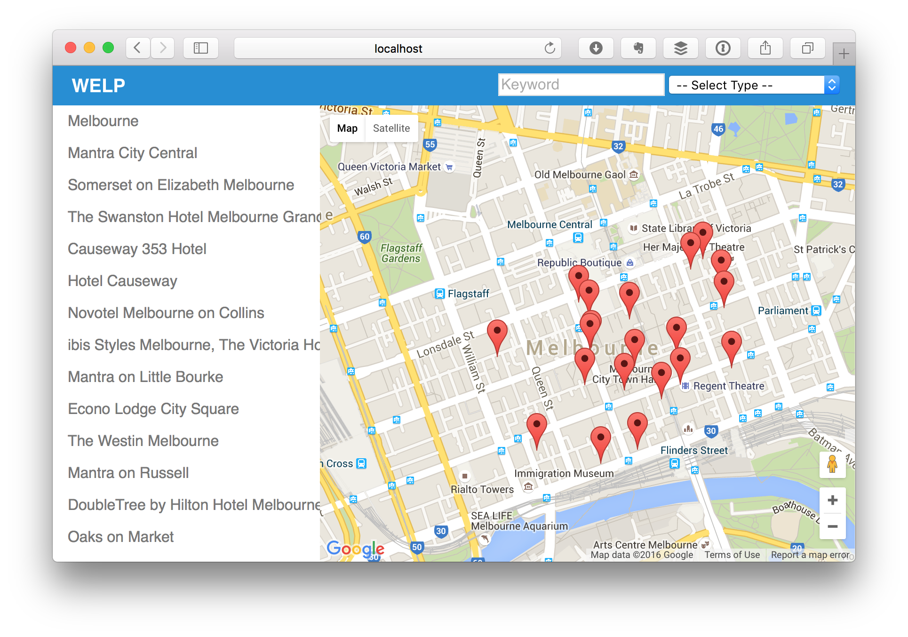

## Writing a Rating Component

We're getting pretty close to the finish line. Can you smell victory yet? Now, it's finally time to put Font Awesome to good use. We're going to build a `Rating` component, so we can display ratings in the menu.

This one is fairly simple, and since we've been getting better at testing, let's try to write the tests first:

```javascript
import { ensureElement } from '../../../test-helpers.js';
import '../Rating.js';

describe('Rating component', function() {
  const tests = {
    3.2:       { full: 3, half: 0, empty: 2 },
    3.5:       { full: 3, half: 1, empty: 1 },
    3.5:       { full: 3, half: 1, empty: 1 },
    4.4:       { full: 4, half: 1, empty: 0 },
    undefined: { full: 0, half: 0, empty: 5 }
  };

  Object.keys(tests).forEach(function(rating) {
    describe(`with ${rating} rating`, function() {
      const { full, half, empty } = tests[rating];
      const data = { rating };

      it(`shows ${full} full star(s)`, function() {
        ensureElement('Rating', data, 'i.fa.fa-star', full);
      });

      it(`shows ${half} half star(s)`, function() {
        ensureElement('Rating', data, 'i.fa.fa-star-half-o', half);
      });

      it(`shows ${empty} empty star(s)`, function() {
        ensureElement('Rating', data, 'i.fa.fa-star-o', empty);
      });
    });
  });
});

```

Here, we're using a technique to [dynamically generate tests][mocha-dynamic-tests] based on a set of predefined test data, since otherwise, all of our tests would be fairly repetitive. The test process itself should be fairly self-explanatory: for each of the given ratings (including `undefined`, which simulates the absence of a rating), we expect the component to show a certain number of full, half, and empty stars. 

We're also making use of another new feature in ES6: [template literals][es6-template-strings]. This lets us interpolate variables into string literals without awkwardly chaining them together using the `+` operator.

Now that we the tests out of the way, it's time to write our component. First, here's the template, `imports/ui/components/Rating/Rating.html`:

```handlebars
<template name="Rating">
  {{#each stars}}
    <i class="fa fa-star"></i>
  {{/each}}
  {{#each halfStars}}
    <i class="fa fa-star-half-o"></i>
  {{/each}}
  {{#each remainder}}
    <i class="fa fa-star-o"></i>
  {{/each}}
</template>
```

Tis is pretty simple: for each of `stars`, `halfStars`, and `remainder`, we simply generate the respective star symbol using Font Awesome. Finally, here's the component's JavaScript code, `imports/ui/components/Rating/Rating.js`:

```javascript
import { Template } from 'meteor/templating';
import './Rating.html';

Template.Rating.onCreated(function() {
  this.rating = () => Math.round( Template.currentData().rating*2 ) / 2 || 0;
});

Template.Rating.helpers({
  stars() {
    let rating = Template.instance().rating();
    return new Array( Math.floor(rating) ).fill(1);
  },
  halfStars() {
    const rating = Template.instance().rating();
    return new Array( Math.ceil(rating) - Math.floor(rating) ).fill(1);
  },
  remainder() {
    const rating = Template.instance().rating();
    return new Array( 5 - Math.ceil(rating) ).fill(1);
  }
});
```

Two things to notice here: first, we're defining another [template instance function][meteor-template-instance-fn] named `rating` that will return the rating, [rounded to the nearest 0.5][js-round-to-nearest-half]. If no rating was provided, it will return 0.

In the helpers, we're making use of a neat trick to get our template to work correctly. Since the `{{#each}}` construct expects an array, that's what we will return from the helpers. What's *inside* the array actually doesn't matter — we only make use of the length. Therefore, we simply generate an array with the required length and fill it with ones (as leaving them empty will not work). Boom! All tests are passing!

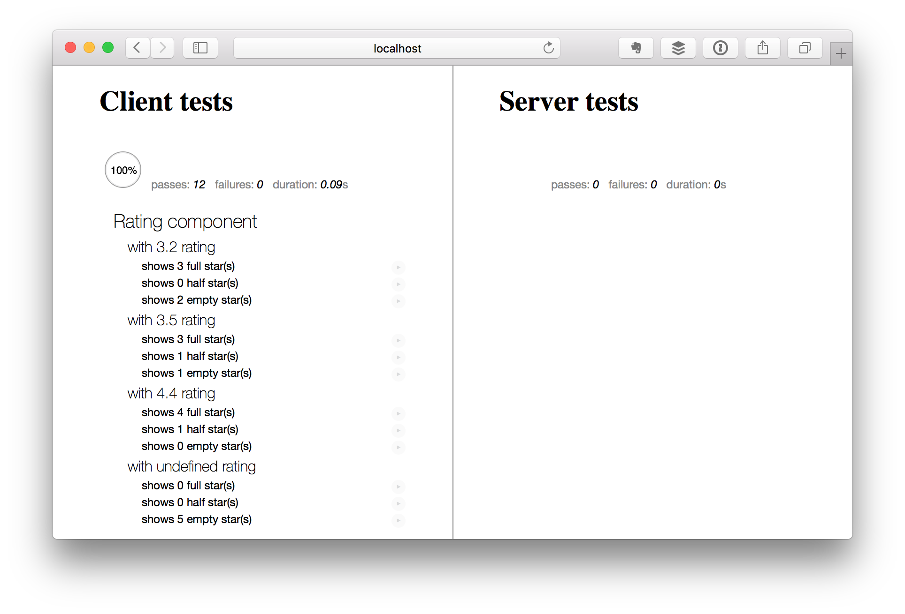

Note that in the above screenshot, I've filtered the tests to only show the Rating component. You can do this by simply clicking on the headline. All the other tests are still there, they are just hidden. We're just getting to the point where we have so many tests they won't fit on a single page — certainly a good problem to have!

[mocha-dynamic-tests]: https://mochajs.org/#dynamically-generating-tests
[es6-template-strings]: https://developer.mozilla.org/en-US/docs/Web/JavaScript/Reference/Template_literals
[meteor-template-instance-fn]: http://guide.meteor.com/blaze.html#attach-functions-to-instance
[js-round-to-nearest-half]: http://stackoverflow.com/a/6138087

## Integrating the Rating Component

Time to make use of our fancy new component! First, let's add to our `imports/ui/startup/client/index.js` file to make it available to our app:

```javascript
// components
// ... omitted for brevity ...
import '../../ui/components/Rating/Rating.js';
```

Next, we'll want to pass those ratings along to the Menu component, so we update our `menuItems()` helper in `imports/ui/pages/home.js` to include the rating:

```javascript
Template.home.helpers({
  // ... omitted for brevity ...
  
  menuItems() {
    const places = Template.instance().places.get();
    return places.map((place) => ({
      title: place.name,
      rating: place.rating,
      link: '#'
    }));
  }
});
```

Finally, we'll need to update the Menu component's template to include the Rating component with every link:

```javascript
      {{#each item in menuItems}}
        <li class="pure-menu-item {{isActive item}}">
          <a href="{{item.link}}" class="pure-menu-link menu-item">
            <span class="rating align-right">
              {{> Rating rating=item.rating}}
            </span>
            {{item.title}}
          </a>
        </li>
      {{/each}}
```

Finally, we'll make some quick tweaks to our stylesheet (`client/main.css`):

```css
.app-menu .menu-item {
  white-space: normal;
}

.rating {
  font-size: 12px;
  line-height: 20px;
}
```

And voilà, we now have ratings!

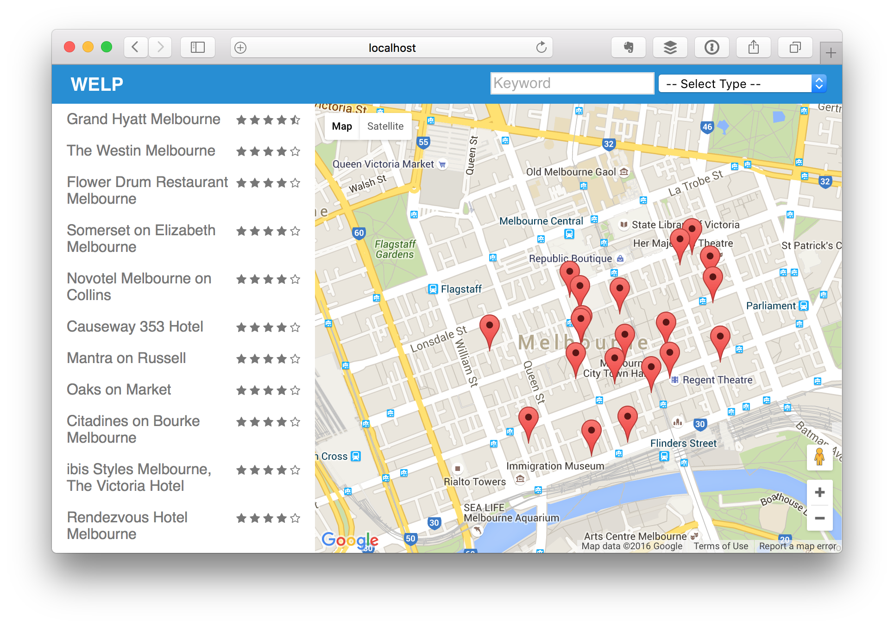

## Creating a PlaceDetail Component

Alright, we're almost there. The final piece of this app is a component to show details about a place when a user clicks on in in the menu. 

Because this component is mostly visual, we're going to start it off very simple, then we'll integrate it into the app, and *then* we'll make it more visually interesting.

Let's start with template, `imports/ui/components/PlaceDetail/PlaceDetail.html`:

```handlebars
<template name="PlaceDetail">
  <h2>{{place.name}}</h2>
</template>
```

Since there are no helpers (for now), our script is equally as simple:

```javascript
import { Template } from 'meteor/templating';
import './PlaceDetail.html';

Template.PlaceDetail.helpers({});
```

Finally, no component should be without tests, so here they are:

```javascript
import { ensureElement } from '../../../test-helpers.js';
import '../PlaceDetail.js';

describe('PlaceDetail component', function() {
  const place = {
    name: "Moe's Tavern"
  };

  it('shows a header with the place name', function() {
    ensureElement('PlaceDetail', { place }, "h2:contains(Moe's Tavern)");
  });
});
```

It's as simple as that. Now, let's move forward and integrate it into our app. First, we need to import it (in `imports/ui/startup/client/index.js`):

```javascript
// components
// ... removed for brevity ...
import '../../ui/components/PlaceDetail/PlaceDetail.js';
```

Next, we'll create a new route, so that we can make use of the fact that menu items are simply links: 

```javascript
FlowRouter.route('/place/:placeId', {
  name: 'place.show',
  action() {
    BlazeLayout.render("mainLayout", { content: "home", header: "Header" });
  }
});
```

Now, we'll replace the following line in `imports/ui/pages/home.html`:

```handlebars
{{> Map center=mapCenter zoom=defaultZoom query=query onPlacesChanged=placesChanged}}
```

with this:

```handlebars
{{#if placeSelected}}
  {{> PlaceDetail place=placeSelected}}
{{else}}
  {{> Map center=mapCenter zoom=defaultZoom query=query onPlacesChanged=placesChanged}}
{{/if}}
```

This makes use of a helper called `placeSelected()`, which looks like this:
We also update the `link` property in the `menuItems()` helper:


```javascript
Template.home.helpers({
  // ... omitted for brevity ...
  menuItems() {
    const places = Template.instance().places.get();
    return places.map((place) => ({
      title: place.name,
      rating: place.rating,
      link: Template.instance().placePath(place)
    })).sort((a, b) => (b.rating||0) - (a.rating||0));
  },
  
  placeSelected() {
    const placeId = Template.instance().placeId();
    const places = Template.instance().places.get();

    return places.find((place) => place.id == placeId);
  }
});
```

These helpers make use of two new template instance methods, `placeId()`, and `placePath()`:

```javascript
Template.home.onCreated(function() {
  this.places = new ReactiveVar([]);
  this.placeId = () => FlowRouter.getParam('placeId');
  this.placePath = (place) => FlowRouter.path('place.show', { placeId: place.id });
})
```

Let's try it out:

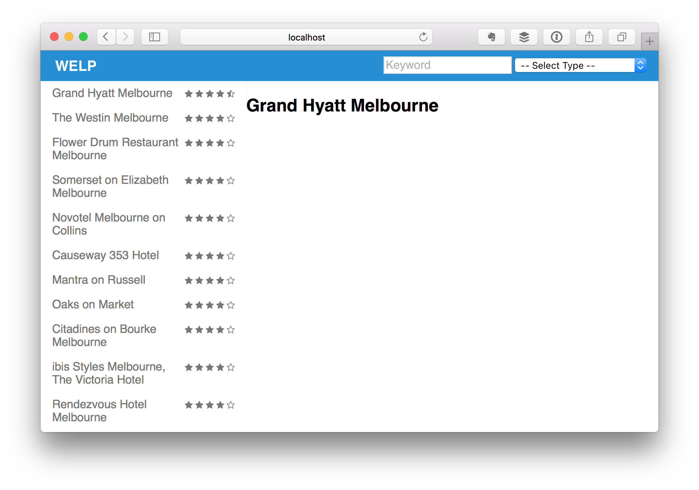

Well, it's not pretty, but it works. Next, we'll make it look nice.

## Styling the PlaceDetail Component

Let's add some more information to the component now:

```handlebars
<template name="PlaceDetail">
  <div class="place-detail">
    <h2>
      {{place.name}}
      <span class="price-level">
        {{#each (priceLevel place)}}
          <i class="fa fa-dollar"></i>
        {{/each}}
      </span>
    </h2>

    <p class="address">{{place.vicinity}}</p>

    <h4>Photos</h4>
    <div class="pure-g">
      {{#each photo in place.photos}}
        <div class="pure-u-1-4">
          
        </div>
      {{/each}}
    </div>
  </div>
</template>
```

And here are the corresponding helpers:

```javascript
Template.PlaceDetail.helpers({
  photoUrl(photo) {
    return 'getUrl' in photo ? photo.getUrl({
      maxWidth: 200, maxHeight: 200
    }) : null;
  },

  priceLevel(place) {
    const priceLevel = place.price_level;
    return new Array(priceLevel || 0).fill(1);
  }
});
```

Of course, let's not forget the tests:

```javascript
describe('PlaceDetail component', function() {
  const place = {
    name: "Moe's Tavern",
    price_level: 2,
    photos: [{
      getUrl() { return 'moes-tavern.jpg' }
    }],
    vicinity: "Springfield U.S.A."
  };

  it('shows a header with the place name', function() {
    ensureElement('PlaceDetail', { place }, "h2:contains(Moe's Tavern)");
  });

  it('shows the address of the place', function() {
    ensureElement('PlaceDetail', { place }, ".address:contains(Springfield U.S.A.)");
  });

  it('shows the price level if available', function() {
    ensureElement('PlaceDetail', { place }, "span.price-level .fa-dollar", 2);
  });

  it('shows photos of the place', function() {
    ensureElement('PlaceDetail', { place }, "h4:contains(Photos)");
    ensureElement('PlaceDetail', { place }, "img[src='moes-tavern.jpg']");
  });
});
```

We'll also add a bit of CSS to our `client/main.css` to make it look nice:

```css
.place-detail {
  padding: 0 15px;
}

.price-level {
  font-size: 14px;
  color: #1f8dd6;
}
```

Finally, we'd like the active link to be highlighted in the menu on the left. We'll need to install the `zimme:active-route` package for this, so let's install it:

    meteor install zimme:active-route
    
Then, we'll update the `isActive()` helper in `imports/ui/components/Menu/Menu.js` as follows:

```javascript
import { ActiveRoute } from 'meteor/zimme:active-route';

Template.Menu.helpers({
  isActive(item) {
    return ActiveRoute.path(item.link) ? 'menu-item-divided pure-menu-selected' : '';
  }
});
```

Finally, here's the end result in the browser:

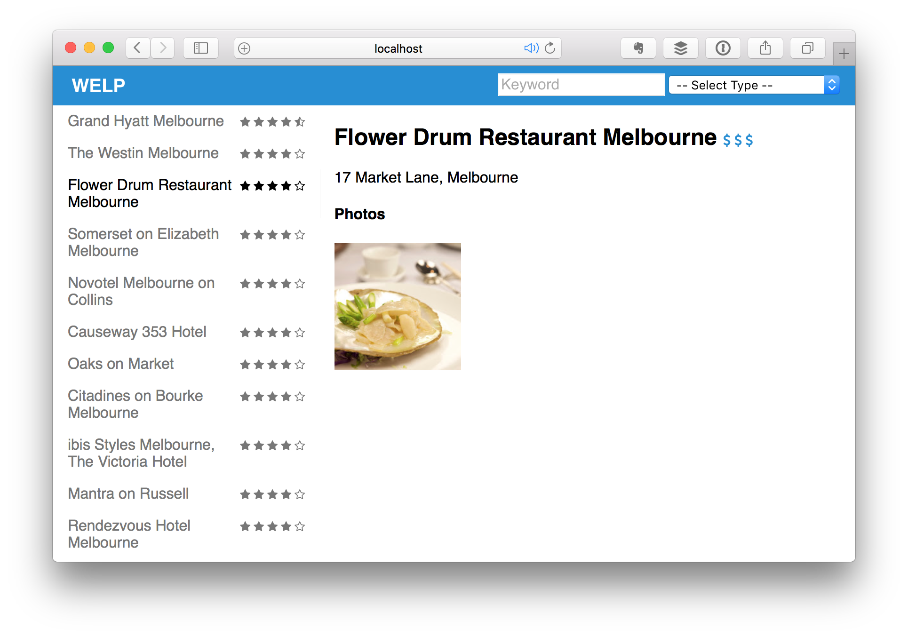

And of course, all our tests are passing:

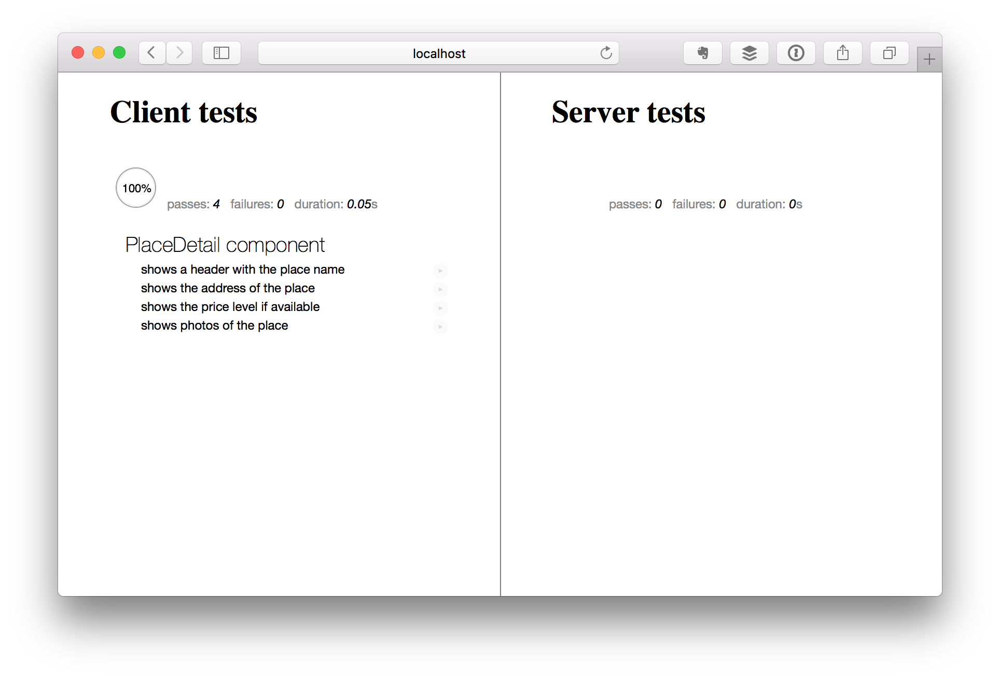

This concludes the tutorial for now.