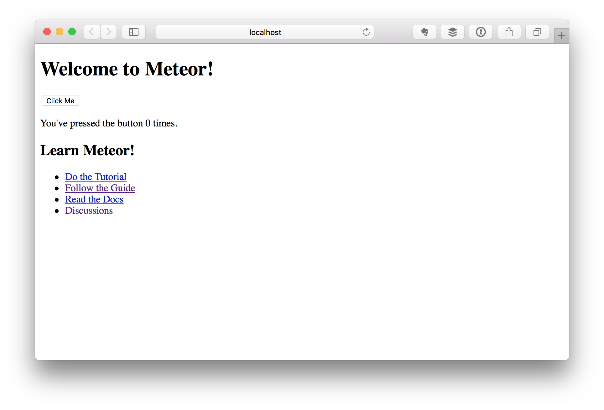

# Meteor Tutorial: Building a React-Yelp-Clone Clone

## Motivation

[Someone][wuworkshop] over at [CodeBuddies][cb]' Slack Channel recently linked me to [Fullstack.io][fullstack]'s [React tutorial][react-tutorial]. Initially I was excited, as learning React has been on my to-do list for a while now. But as I started following along, I quickly got frustrated by how much work was involved. After half an hour, I still hadn't written a single line of actual app code, but I had already installed about 20 NPM packages, and written copious amounts of arcane configuration files.

Long story short, after scrolling forward for a bit and realizing I would still be spending at least another 20 minutes on my setup, I got impatient and decided to do this project in Meteor instead. This is the story of what happened next.

[wuworkshop]: https://github.com/wuworkshop
[cb]: http://codebuddies.org
[fullstack]: http://www.fullstack.io
[react-tutorial]: https://www.fullstackreact.com/articles/react-tutorial-cloning-yelp/
[react-yelp-clone]: https://github.com/fullstackreact/react-yelp-clone

## Creating the app

First, we'll ask Meteor to create a new project for us. This couldn't be any simpler:

    meteor create meteor-yelp-clone

Now, we simply `cd` into the new directory and run `meteor`, and we already have a working server that we can visit in the browser.

    cd meteor-yelp-clone
    meteor

Compare that to the React version, which spends the first 10 minutes setting up the build environment. Granted, there isn't much to see here either, but at least there's a little button we can click on that increases a counter. Even an `npm start` script is already preconfigured for us.

The score so far: Meteor: 1, React: 0.

## Font Awesome

Again, this is pretty simple. There's already a number of prebuilt packages available, so all we have to do here is run

    meteor add natestrauser:font-awesome

and we're good to go. We don't even need to restart the server, it automatically detects the new package and loads it for us. Awesome.

To test that this is working, we can add a little `<i class="fa fa-star"></i>` to our main.html. And while the React Tutorial is still explaining `postcss` and CSS modules, we're already moving on to the next step. Meteor: 2 - React: 0.

## Setting up Testing

This is something I don't have much experience with but from what I know so far, we'll want to start with the `practicalmeteor:mocha` package.

    meteor add practicalmeteor:mocha

This conveniently also adds sinon and chai for mocking and expectations.

However, we have nothing to test yet, because unlike React, we don't need a dedicated app container. Meteor already does that for us. We can, however, already configure our `package.json` so we can run our tests easily by typing `npm test`. In order to do that, we simply add the following line to the `"scripts"` section:

    "scripts": {
      "start": "meteor run",
      "test": "meteor test --driver-package=practicalmeteor:mocha --port 3030"
    }

The `meteor test` command needs us to specify the driver package (there are [several different ones available][TBD]). Since the `practicalmeteor:mocha` package includes an HTML test runner that will display all of our tests in a browser, it actually starts a full Meteor server. Because our app is already running on port 3000, we'll have to tell it to run on a different port.

And while the React folks are still tweaking their `karma.conf.js`, we're off to the next step. Meteor: 3 - React: still 0.
